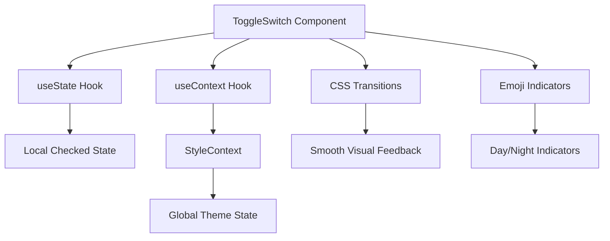
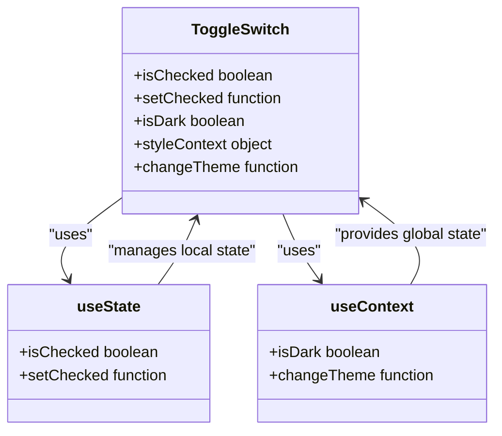
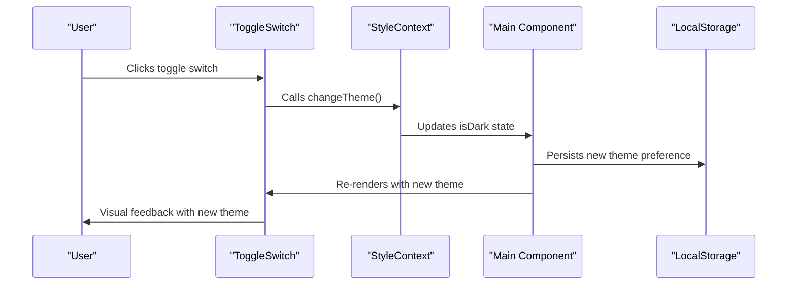
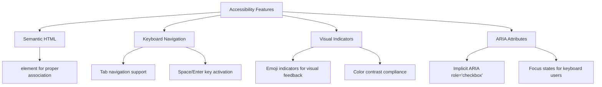
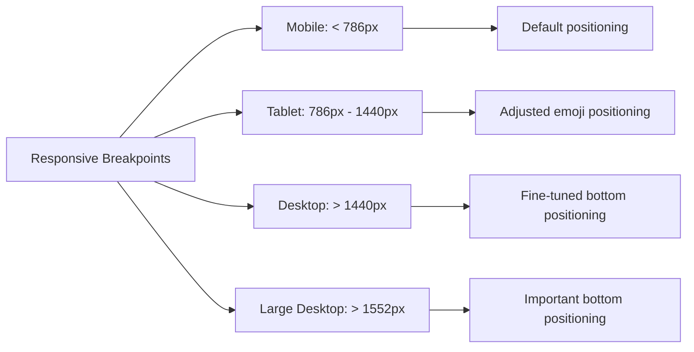
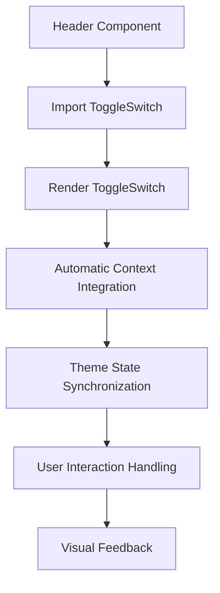
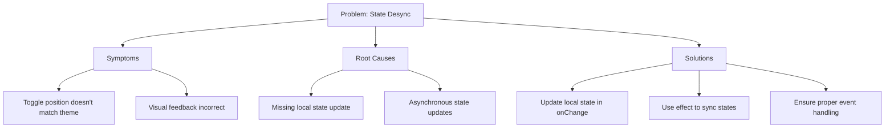

# Toggle Switch Component

<cite>
**Referenced Files in This Document**   
- [ToggleSwitch.js](file://src/components/ToggleSwitch/ToggleSwitch.js)
- [ToggleSwitch.scss](file://src/components/ToggleSwitch/ToggleSwitch.scss)
- [StyleContext.js](file://src/contexts/StyleContext.js)
- [Main.js](file://src/containers/Main.js)
- [useLocalStorage.js](file://src/hooks/useLocalStorage.js)
</cite>

## Table of Contents
1. [Introduction](#introduction)
2. [Component Architecture](#component-architecture)
3. [State Management](#state-management)
4. [Theme System Integration](#theme-system-integration)
5. [Visual Design and Transitions](#visual-design-and-transitions)
6. [Accessibility Features](#accessibility-features)
7. [Responsive Behavior](#responsive-behavior)
8. [Usage Examples](#usage-examples)
9. [Common Issues and Troubleshooting](#common-issues-and-troubleshooting)
10. [Conclusion](#conclusion)

## Introduction

The ToggleSwitch component is a UI element that enables users to switch between light and dark themes in the portfolio application. This documentation provides a comprehensive analysis of the component's implementation, covering its visual design, user interaction behavior, and integration with the global theme system. The component leverages React's useContext and useState hooks to manage both local and global state, ensuring seamless theme switching with persistent user preferences.

**Section sources**
- [ToggleSwitch.js](file://src/components/ToggleSwitch/ToggleSwitch.js#L1-L28)

## Component Architecture

The ToggleSwitch component follows a clean, functional component pattern with proper separation of concerns between presentation and logic. It is implemented as a stateful functional component that manages its own local state while also interacting with the global theme context.



**Diagram sources**
- [ToggleSwitch.js](file://src/components/ToggleSwitch/ToggleSwitch.js#L5-L25)
- [ToggleSwitch.scss](file://src/components/ToggleSwitch/ToggleSwitch.scss#L1-L110)

**Section sources**
- [ToggleSwitch.js](file://src/components/ToggleSwitch/ToggleSwitch.js#L1-L28)
- [ToggleSwitch.scss](file://src/components/ToggleSwitch/ToggleSwitch.scss#L1-L110)

## State Management

The ToggleSwitch component employs a dual state management approach, combining local component state with global context state to ensure both immediate visual feedback and persistent theme preferences.



The component initializes its local state using the `useState` hook, synchronizing it with the current theme state from the context. This ensures that the toggle switch visually reflects the current theme when the component mounts.

**Section sources**
- [ToggleSwitch.js](file://src/components/ToggleSwitch/ToggleSwitch.js#L6-L8)
- [useLocalStorage.js](file://src/hooks/useLocalStorage.js#L1-L38)

## Theme System Integration

The ToggleSwitch component is tightly integrated with the application's global theme system through the StyleContext. This integration enables consistent theme management across all components in the application.



The component uses `useContext(StyleContext)` to access both the current theme state (`isDark`) and the `changeTheme()` function. When the user interacts with the toggle, it triggers the theme change function while also updating its local checked state for immediate visual feedback.

**Diagram sources**
- [ToggleSwitch.js](file://src/components/ToggleSwitch/ToggleSwitch.js#L6-L25)
- [Main.js](file://src/containers/Main.js#L25-L133)
- [StyleContext.js](file://src/contexts/StyleContext.js#L1-L9)

**Section sources**
- [ToggleSwitch.js](file://src/components/ToggleSwitch/ToggleSwitch.js#L6-L25)
- [Main.js](file://src/containers/Main.js#L25-L133)

## Visual Design and Transitions

The ToggleSwitch component features a modern, minimalist design with smooth CSS transitions that provide excellent visual feedback during state changes. The visual design includes emoji indicators that change based on the current theme state.

```mermaid
flowchart LR
A[Initial State] --> |Light Theme| B[☀️ Emoji]
A --> |Dark Theme| C[🌜 Emoji]
B --> D[User Interaction]
C --> D
D --> E[CSS Transform: translateX(26px)]
E --> F[Smooth Transition: 0.4s]
F --> G[Final State]
G --> |Light Theme| H[🌜 Emoji]
G --> |Dark Theme| I[☀️ Emoji]
```

The component uses CSS transitions to animate the slider movement, providing a 0.4-second smooth transition when the user toggles between themes. The emoji indicator is positioned within the slider and moves along with it, creating a cohesive visual effect.

**Diagram sources**
- [ToggleSwitch.scss](file://src/components/ToggleSwitch/ToggleSwitch.scss#L1-L110)
- [ToggleSwitch.js](file://src/components/ToggleSwitch/ToggleSwitch.js#L15-L20)

**Section sources**
- [ToggleSwitch.scss](file://src/components/ToggleSwitch/ToggleSwitch.scss#L1-L110)

## Accessibility Features

The ToggleSwitch component incorporates several accessibility features to ensure it is usable by all users, including those who rely on assistive technologies.



The component uses a `<label>` element with an associated `<input type="checkbox">`, which provides built-in accessibility features. The checkbox role is automatically applied by browsers, making the component navigable via keyboard and properly announced by screen readers.

**Section sources**
- [ToggleSwitch.js](file://src/components/ToggleSwitch/ToggleSwitch.js#L10-L14)
- [ToggleSwitch.scss](file://src/components/ToggleSwitch/ToggleSwitch.scss#L1-L110)

## Responsive Behavior

The ToggleSwitch component is designed to be responsive across different screen sizes, with specific media queries that adjust positioning for optimal display on various devices.



The component includes media queries that adjust the positioning of the emoji indicator based on screen width, ensuring proper alignment across different device sizes. This responsive design prevents layout issues and maintains visual consistency.

**Diagram sources**
- [ToggleSwitch.scss](file://src/components/ToggleSwitch/ToggleSwitch.scss#L75-L109)

**Section sources**
- [ToggleSwitch.scss](file://src/components/ToggleSwitch/ToggleSwitch.scss#L75-L109)

## Usage Examples

The ToggleSwitch component is designed for easy integration into the application's header or other UI areas where theme switching is appropriate. It requires no configuration and automatically integrates with the global theme system.



The component is used in the Header component (not analyzed here) and automatically connects to the StyleContext without requiring any props. This zero-configuration design makes it easy to use and maintain consistency across the application.

**Section sources**
- [ToggleSwitch.js](file://src/components/ToggleSwitch/ToggleSwitch.js#L1-L28)
- [Main.js](file://src/containers/Main.js#L25-L133)

## Common Issues and Troubleshooting

Despite its robust design, the ToggleSwitch component may encounter issues related to state synchronization, persistence, or visual rendering. This section addresses common problems and their solutions.

### State Desynchronization

One potential issue is state desynchronization between the local `isChecked` state and the global `isDark` state. This can occur if the theme is changed programmatically without updating the local state.

**Solution**: The current implementation properly synchronizes states by calling `setChecked(!isChecked)` within the onChange handler, ensuring local state remains consistent with global state.



### Local Storage Persistence

The component relies on the parent context system for local storage persistence through the `useLocalStorage` custom hook. Issues with persistence typically stem from the hook implementation rather than the ToggleSwitch itself.

**Troubleshooting Steps**:
1. Verify that `window.localStorage` is available and not blocked
2. Check that the `useLocalStorage` hook is properly handling serialization
3. Ensure the key name ("isDark") matches across components
4. Validate that error handling in the hook doesn't silently fail

**Section sources**
- [ToggleSwitch.js](file://src/components/ToggleSwitch/ToggleSwitch.js#L6-L25)
- [Main.js](file://src/containers/Main.js#L27-L27)
- [useLocalStorage.js](file://src/hooks/useLocalStorage.js#L1-L38)

## Conclusion

The ToggleSwitch component is a well-designed, accessible UI element that effectively manages theme switching in the portfolio application. By leveraging React's context API and state hooks, it provides a seamless user experience with immediate visual feedback and persistent preferences. The component's integration with the global theme system ensures consistency across the application, while its responsive design and accessibility features make it usable across different devices and for all users. The implementation demonstrates best practices in React component design, state management, and user experience considerations.