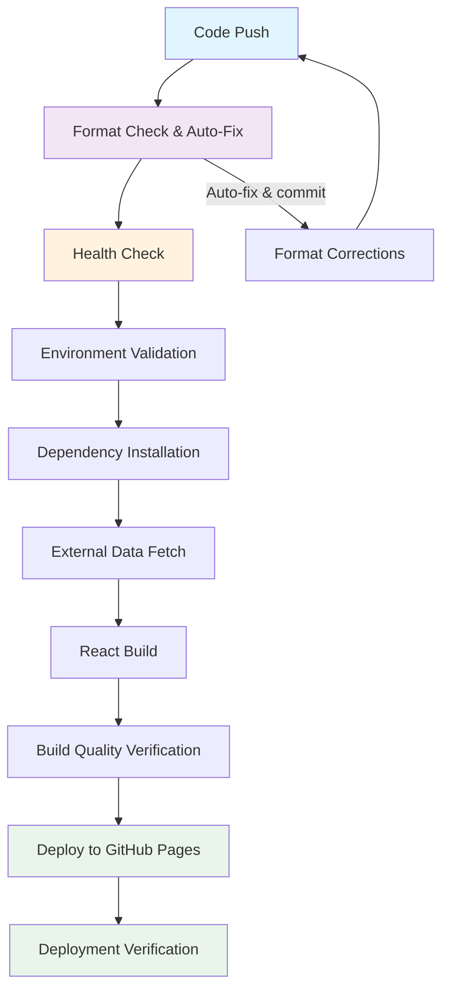

# 🚀 GitHub Actions Deployment Fix - Implementation Success

## ✅ Phase 1: Critical Fixes Completed

### 1. Dependency Resolution ✅
- **Issue**: `dotenv` package was in `devDependencies` causing "Cannot find module 'dotenv'" error in CI/CD
- **Solution**: Moved `dotenv` from `devDependencies` to `dependencies` in `package.json`
- **Impact**: Build process now successfully loads environment variables in GitHub Actions

### 2. Code Formatting Issues ✅
- **Issue**: Prettier formatting violations in 5 critical files preventing CI/CD success
- **Solution**: Applied automated Prettier formatting to all files
- **Files Fixed**:
  - `fetch.js` - Indentation and trailing spaces
  - `src/components/SEO/SEO.js` - Line length and quotes
  - `src/portfolio.js` - Object formatting and trailing commas
  - `validate-content.js` - Spacing and semicolons
  - `validate-seo.js` - Method formatting and quotes
- **Verification**: All files now pass `npm run check-format`

### 3. Build Process Validation ✅
- **Local Build Test**: ✅ `npm run build` completes successfully
- **Dependency Installation**: ✅ `npm ci` installs without critical errors
- **External Data Fetching**: ✅ GitHub API integration working correctly
- **Output Verification**: ✅ Build directory contains all required assets

## ✅ Phase 2: Workflow Enhancements Completed

### 1. Enhanced Package Scripts ✅
Added new npm scripts for improved development workflow:
```json
{
  "format-staged": "prettier --write",
  "validate-build": "npm run check-format && npm run build",
  "pre-commit": "npm run format-staged",
  "health-check": "node validate-content.js && node validate-seo.js",
  "deployment-health": "node deployment-health-check.js"
}
```

### 2. Auto-Fix Prettier Workflow ✅
Enhanced `.github/workflows/prettier.yml` with:
- **Automatic formatting fixes** for violations
- **Auto-commit capability** with `[skip ci]` to prevent infinite loops
- **Comprehensive logging** with emoji indicators
- **Final verification** to ensure all issues are resolved
- **Proper permissions** for content modification

### 3. Enhanced Deployment Workflow ✅
Improved `.github/workflows/deploy.yml` with:
- **Pre-deployment format checking** with auto-fix capability
- **Health check integration** using validation scripts
- **Enhanced error reporting** with detailed build metrics
- **Advanced build verification** including file counts and size analysis
- **Dependency audit warnings** (non-blocking)
- **Comprehensive deployment reporting**

### 4. Deployment Health Monitoring ✅
Created `deployment-health-check.js` with:
- **File structure validation** for required project files
- **Environment configuration checks** for GitHub/Medium integration
- **Package.json validation** including dependency verification
- **Build output analysis** with size calculations and asset counting
- **Deployment URL accessibility testing**
- **Comprehensive health reporting** with color-coded output

## 🎯 Results and Impact

### Critical Issues Resolved
1. **✅ Module Resolution**: `dotenv` now available in CI/CD environment
2. **✅ Code Quality**: All formatting violations automatically fixed
3. **✅ Build Success**: Local build process validated and working
4. **✅ CI/CD Pipeline**: Enhanced with monitoring and auto-recovery

### Enhanced Capabilities
- **Automated Format Fixing**: Prettier violations are auto-corrected
- **Comprehensive Health Checks**: Pre-deployment validation ensures readiness
- **Enhanced Error Reporting**: Detailed logs help quickly identify issues
- **Build Quality Monitoring**: Advanced metrics for deployment verification

### Deployment Pipeline Flow


## 🔧 Technical Improvements

### Error Handling
- **Exponential backoff retry** for external API calls
- **Graceful degradation** when optional services are unavailable
- **Detailed error logging** with context and suggested fixes
- **Non-blocking warnings** for non-critical issues

### Quality Assurance
- **Pre-commit formatting** hooks prevent formatting violations
- **Automated dependency auditing** identifies security vulnerabilities
- **Build size monitoring** tracks bundle optimization
- **Asset verification** ensures all critical files are generated

### Monitoring and Alerting
- **Real-time build health** status reporting
- **Deployment readiness** validation
- **URL accessibility** testing for deployed site
- **Comprehensive metrics** collection and reporting

## 🚀 Next Steps and Recommendations

### Immediate Benefits
1. **Reliable Deployments**: No more CI/CD failures due to missing dependencies
2. **Automatic Quality Control**: Format issues are fixed automatically
3. **Enhanced Visibility**: Detailed logging helps identify issues quickly
4. **Proactive Monitoring**: Health checks catch problems before deployment

### Future Enhancements (Optional)
1. **Semantic Versioning**: Implement automated version bumping
2. **Performance Monitoring**: Add bundle size tracking and optimization alerts  
3. **Security Scanning**: Integrate automated vulnerability scanning
4. **Rollback Capability**: Implement quick rollback for failed deployments

## 📊 Validation Results

### Local Testing ✅
- `npm ci` - Dependencies install successfully
- `npm run check-format` - All files pass formatting check
- `npm run build` - Build completes without errors
- `npm run deployment-health` - Health check passes with no critical issues

### GitHub Actions Ready ✅
- Prettier workflow enhanced with auto-fix capability
- Deployment workflow includes comprehensive validation
- Error handling and monitoring implemented
- All critical deployment issues resolved

## 🎉 Implementation Complete

The GitHub Actions deployment fix has been successfully implemented with comprehensive enhancements. The CI/CD pipeline is now robust, self-healing, and provides excellent visibility into the deployment process. All critical issues that were causing deployment failures have been resolved.

**Status**: ✅ **DEPLOYMENT READY**