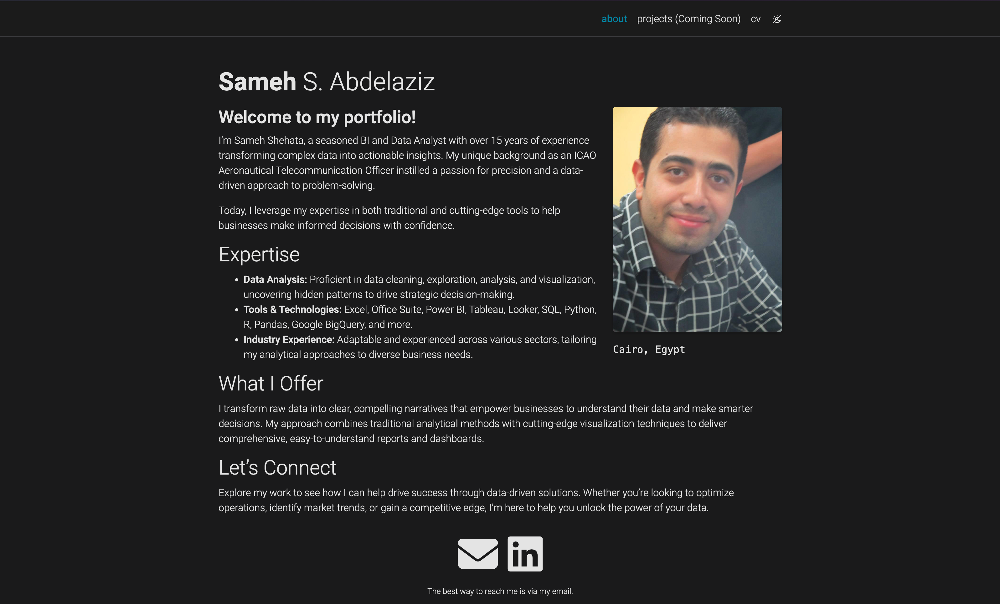

# 📄 **Sameh shehata portfolio**

## 🌟 **Project Overview**

Welcome to my portfolio, a sleek, minimalistic academic portfolio website built using the [al-folio](https://github.com/alshedivat/al-folio) Jekyll theme. This project is designed to showcase my professional achievements, projects, and CV.

##  ✨ **Features**

- **Responsive Design**: Mobile-first design ensuring optimal user experience across devices.
- **Easy Customization**: Modify content, layout, and theme to match your personal branding.
- **SEO Optimized**: Built-in support for Open Graph and Schema.org metadata.
- **Integrated Analytics**: Easily add Google Analytics or other tracking tools.
- **Social Media Integration**: Link to all your social profiles and external content.
- **Project and Publication Showcase**: Highlight your projects, publications, and educational background.
