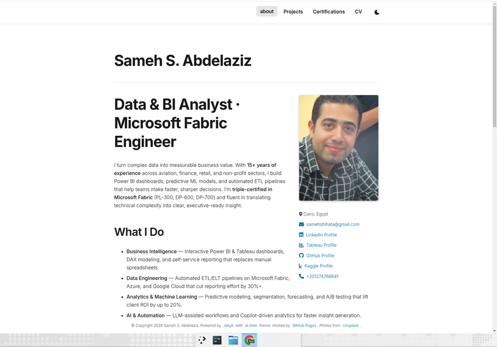

# Sameh S. Abdelaziz — Data & BI Portfolio

A fast, responsive portfolio built with the [al-folio](https://github.com/alshedivat/al-folio) Jekyll theme and deployed on GitHub Pages. It showcases my work as a **Data & BI Analyst and Microsoft Fabric Engineer** — Power BI dashboards, predictive ML models, automated ETL pipelines, professional certifications, and a downloadable CV.

**Live site:** https://samehshi.github.io/portfolio/

<div align="center">

[](https://samehshi.github.io/portfolio/)

</div>

## Highlights

- **About** — profile, focus areas, and clickable contact links (email, phone, LinkedIn, GitHub, Kaggle, Tableau).
- **Projects** — 12 data analytics & BI projects with branded covers, grouped by Power BI / Data Science / Work / Study, each with external links (Kaggle, dashboards).
- **CV** — full résumé with downloadable PDF and a structured experience/skills/certifications breakdown.
- **Certifications** — live Credly badges and Microsoft Fabric credentials (PL-300, DP-600, DP-700).
- **Polished UI** — modern navbar with brand monogram and active-state styling, light/dark theme toggle, and a mobile-friendly responsive layout.
- **SEO** — per-page titles/descriptions, Open Graph & Twitter cards with absolute image URLs, and JSON-LD structured data (Person, WebSite, per-project CreativeWork + BreadcrumbList).
- **Analytics** — Google Analytics 4 (`anonymize_ip`) with custom event tracking: scroll depth, engaged time, navigation clicks, contact clicks, outbound links, file/CV downloads, search, and theme toggle.

## Tech Stack

- **Jekyll** (al-folio theme) · Liquid templating
- **SCSS** for styling (component structure in `_sass/`)
- **GitHub Pages** for hosting (auto-build `main` → `gh-pages`)
- **Google Analytics 4** for usage analytics

## Project Structure

```
_pages/         Static pages (about, cv, projects, certifications)
_projects/      Portfolio items (one Markdown file per project)
_data/          Structured data (cv.yml, etc.)
_layouts/       Page layouts
_includes/      Reusable components (header, metadata, analytics, ...)
_sass/          SCSS partials
assets/         Images, PDF, compiled CSS/JS
_config.yml     Production config (baseurl: /portfolio)
_config_dev.yml Development overrides (baseurl: "")
```

## Local Development

Requires Ruby + Bundler.

```bash
bundle install

# Dev server (no /portfolio baseurl, live at http://localhost:8080)
bundle exec jekyll serve --config _config.yml,_config_dev.yml --port 8080

# Production build (with /portfolio baseurl)
JEKYLL_ENV=production bundle exec jekyll build
```

## Deployment

Pushing to `main` triggers a GitHub Actions build that publishes the compiled `_site/` to the `gh-pages` branch, which GitHub Pages serves at https://samehshi.github.io/portfolio/.

## Credits

Built on the open-source [al-folio](https://github.com/alshedivat/al-folio) theme. Powered by [Jekyll](https://jekyllrb.com/) and [GitHub Pages](https://pages.github.com/).
